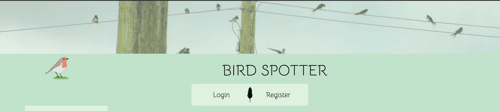

# BIRD SPOTTER



Bird Spotter UK is a fullstack app that allows users to record and track sightings of birds in the uk. 

---

## Usage

The app was created using Docker, meaning anyone with Docker will be able to clone and run the app on any machine. 

To build and run the app: 

```
    git clone https://github.com/RASBENNETT/bird_spotter

    docker-compose build

    docker-compose up
```
---

## Construction